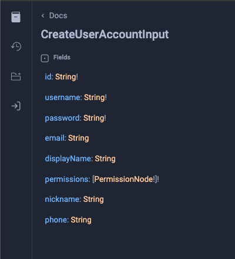
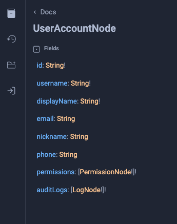
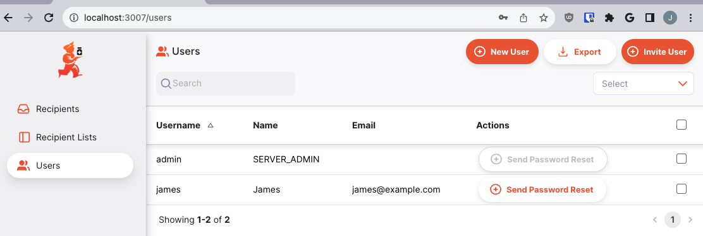
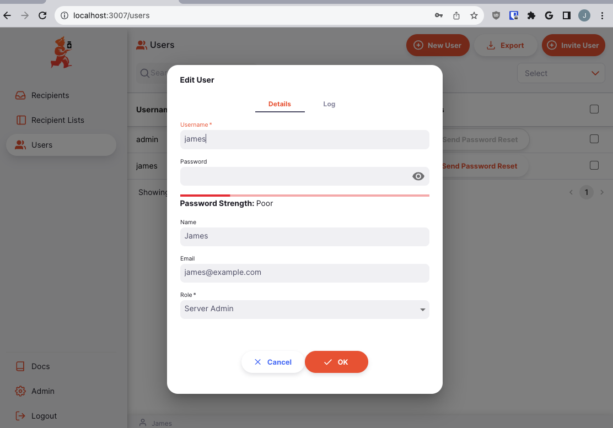
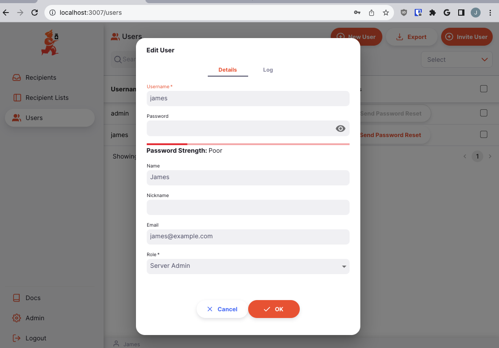
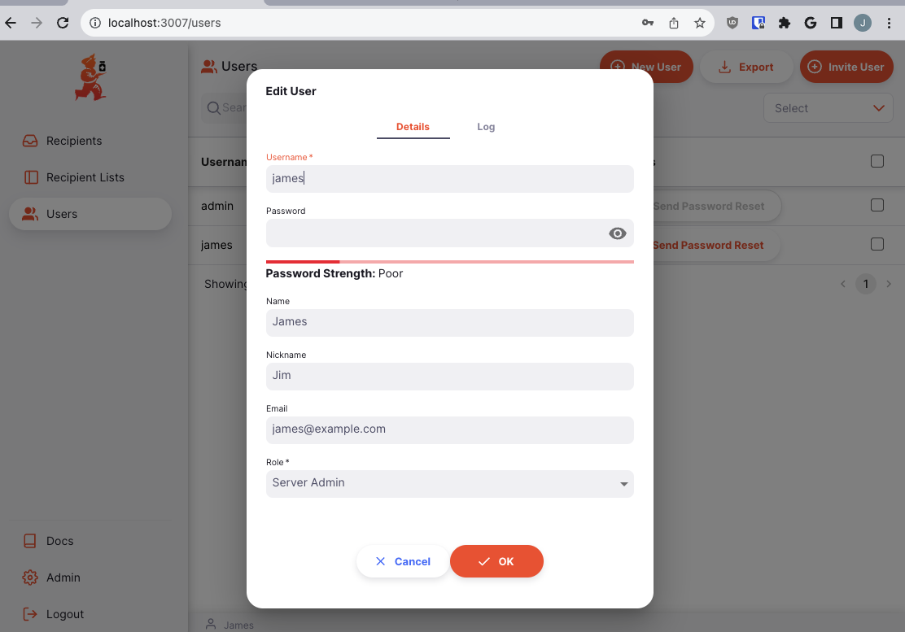

# So you want to add a new field?

Let's get started!

For this tutorial we'll assume we're wanting to add a `nickname` field to the user account.

If at any stage you get stuck, example code for this tutorial is available in the `tutorial-1` branch of this repository.

> Note: Instead of following this tutorial exactly you might like to experiment with adding a different field such as an address or phone number to extend your learning.

## Background Information

The Notify Server is broken up into two parts, frontend and backend.

The frontend is written in typescript and react, this is what displays the website users use to configure the system.
To get started with the frontend, see the [frontend README](../../frontend/README.md).

The backend is written in rust, using actix-web and diesel.
To get started with the backend, see the [backend README](../../backend/README.md).

First up, we'll be focussing on the backend rust code.
To get started create a new branch of the code for your changes, open a terminal to the `backend` folder and run `cargo test --no-default-features` to make sure everything is ship shape to get started!

## Step 1: Adding the field to the database

In notify, we actually have two databases associated with the application.
One is called `datasource`, this crate is intended to be used in a read only mode to query data used in notifications, alerts, etc. We assume this database is Postgres, and might live on a completely different machine.

> Note: For this tutorial you won't need postgres, but if don't have it setup you will need to remember to run `cargo test --no-default-features` to ignore any connection errors from the postgres database.

The internal database used to manage the configuration is called `repository`, this is where we need to add the new field.

Notify uses an SQLite database to store it's configuration.
To communicate with the sqlite database, we use [diesel](https://diesel.rs/).

> Note: Because we've inherited the code base from open-mSupply, we are using an older version of diesel v1.x. The documentation for this version is available [here](https://docs.diesel.rs/1.4.x/diesel/index.html).

To add a new field to the database, we need to create a migration file for our change.
This can be done with the [Diesel CLI tool](https://crates.io/crates/diesel_cli).

<details open>
<summary>Setting up Diesel </summary>

If Diesel CLI is not already installed on your machine, run the following command to install it:

```
cargo install diesel_cli --no-default-features --features "postgres sqlite"
```

By default, diesel_cli requires a set of features, which includes several not used in Notify. This command specifies that diesel_cli will only depend on postgres and sqlite.

Diesel CLI requires a database it can use to apply migrations. The database configuration can be passed as a command line argument, but it's easier to setup a `.env` file in the `backend/repository` folder.

If you want diesel to use the default sqlite database, you can run this command (on mac or linux) to create the `.env` file:

`echo DATABASE_URL=../notify.sqlite > .env`

</details>

### Adding the migration

---

Now that your diesel cli is setup, you should be able to run a command to create a migrations file called `add_nickname_to_user_account`:

From the `backend/repository` folder, run:

```
diesel migration generate add_nickname_to_user_account
```

You should see output like this:

```bash
Creating migrations/2023-08-16-212010_add_nickname_to_user_account/up.sql
Creating migrations/2023-08-16-212010_add_nickname_to_user_account/down.sql
```

And you should see 2 new files in the `backend/repository/migrations` folder.


In the `up.sql` file we need to add the sql to create the new column in the database.

```sql
ALTER TABLE user_account ADD COLUMN nickname TEXT;
```

In the `down.sql` file we would normally add the sql to remove the column from the database, but because sqlite doesn't support removing columns we'll leave this blank for now.

To test that your new migration works, run:

```bash
diesel migration run
```

If you want to look at the database, many of us use [DB Browser for SQLite](https://sqlitebrowser.org/) or [DBeaver](https://dbeaver.io/download/).
There is also a vscode plugin called [SQLite](https://marketplace.visualstudio.com/items?itemName=alexcvzz.vscode-sqlite) that can be used to view the database.

## Step 2: Add the field to `UserAccountRow` in the `repository` crate

Great! We have our database setup, now we need to add the field to the rust code.

Navigate to the `backend/repository/src/db_diesel/user_account_row.rs` file.

Near the top of the file, you should see a call to a macro called `table!` that looks something like this:

```rust
table! {
    user_account (id) {
        id -> Text,
        username -> Text,
        hashed_password -> Text,
        email -> Nullable<Text>,
        display_name -> Text,
        password_reset_token -> Nullable<Text>,
        password_reset_datetime -> Nullable<Timestamp>,
    }
}
```

This table macro is used by diesel to generate the rust code to interact with the database table.
The resulting rust code is imported into this file like this:

```rust
    use super::{user_account_row::user_account::dsl as user_account_dsl}
```

This means we can refer to the diesel generated code using the `user_account_dsl` prefix.

### Add a new field

To add the new field, we need to add a new line to the table macro, and then add a new field to the `UserAccountRow` struct.

```rust
table! {
    user_account (id) {
        id -> Text,
        username -> Text,
        hashed_password -> Text,
        email -> Nullable<Text>,
        display_name -> Text,
        password_reset_token -> Nullable<Text>,
        password_reset_datetime -> Nullable<Timestamp>,
        nickname -> Nullable<Text>,
    }
}
```

You'll notice that we've marked the new field as `Nullable`, this is because we didn't add a not-null constraint in the database table when we created the migration. If you want to add a not-null constraint, you'll need to add a default value to the migration file, and then change the rust code to not be nullable.

Diesel can usually create this `table!` macro for us using the command `diesel print-schema` from the `backend/repository` folder. Running this command will print out the `table!` macros for all the tables in your database.

> Note: This doesn't handle some things such as diesel enums, so sometimes we need to edit the `table!` manually.

You'll also notice that this `table!` macro doesn't use `rust` types in its definition, for example `Text` and `Nullable`. We need to map these database types and constraints to a `struct` in rust to represent the data.

### Add the new field to the struct

Adding the new field to the struct is done in the `UserAccountRow` struct, which is defined in the same file.

```rust
#[table_name = "user_account"]
pub struct UserAccountRow {
    pub id: String,
    pub username: String,
    pub hashed_password: String,
    pub email: Option<String>,
    pub display_name: String,
    pub password_reset_token: Option<String>,
    pub password_reset_datetime: Option<NaiveDateTime>,
}
```

You'll see that `Text` is mapped to `String`, and `Nullable` is mapped to `Option`.

Add the new field to the struct:

```rust
#[table_name = "user_account"]
pub struct UserAccountRow {
    pub id: String,
    pub username: String,
    pub hashed_password: String,
    pub email: Option<String>,
    pub display_name: String,
    pub password_reset_token: Option<String>,
    pub password_reset_datetime: Option<NaiveDateTime>,
    pub nickname: Option<String>,
}
```

### Check for compilation errors

Check that everything still works correctly by running `cargo check`.

You'll probably find that there are a few errors such as this.

```
    error[E0063]: missing field `nickname` in initializer of `user_account_row::UserAccountRow`
        --> repository/src/mock/user_account.rs:15:5
```

This is where rust is both very helpful, but also a bit annoying. Everywhere that we're using the `UserAccountRow` struct, we need to update it to include the new field.

In this example the error is in our mock data.
Mock data is used in our test cases to setup a database with some data to test against.

Navigating to `repository/src/mock/user_account.rs:15:5` you'll find some code like this..

```rust
pub fn mock_user_account_a() -> UserAccountRow {
    UserAccountRow {
        id: String::from("id_user_account_a"),
        username: String::from("username_a"),
        hashed_password: String::from(
            "$2a$12$r44KN8LOqxSyn1VhU16AjuvJyWRnlE51zBDeuPFxkgbhjPDfNLxAG",
        ), // hashed version of `password`
        email: Some(String::from("username_a@openmsupply.foundation")),
        display_name: String::from("user_account_a"),
        password_reset_token: None,
        password_reset_datetime: None,
    }
}
```

This function returns a `UserAccountRow` struct with some mock data.

We can fix this by adding a nickname to the mock data.

```rust
pub fn mock_user_account_a() -> UserAccountRow {
    UserAccountRow {
        id: String::from("id_user_account_a"),
        username: String::from("username_a"),
        hashed_password: String::from(
            "$2a$12$r44KN8LOqxSyn1VhU16AjuvJyWRnlE51zBDeuPFxkgbhjPDfNLxAG",
        ), // hashed version of `password`
        email: Some(String::from("username_a@openmsupply.foundation")),
        display_name: String::from("user_account_a"),
        password_reset_token: None,
        password_reset_datetime: None,
        nickname: Some("User A's Nick Name".to_string()),
    }
}
```

Running `cargo check` again, you'll find that there are still some errors with the mock data.

### Default data

Let's fix the rest of the mock data error using [rust's default trait](https://doc.rust-lang.org/std/default/trait.Default.html).

Effectively, using the default trait means that most of our mock user accounts won't have a nickname. Their nickname will be set to `None`.

Defaulting values in rust is a trade off, it means that if we add something else to the struct, rust won't warn us that we might need to put data into the field, and we might not notice all the places that it might need to be set. As a general rule, defaulting data in a test case can be a good idea, but having one mock user account without default is a good idea. Default should be used sparingly in production code.

```rust
pub fn mock_user_account_b() -> UserAccountRow {
    UserAccountRow {
        id: String::from("id_user_account_b"),
        username: String::from("username_b"),
        hashed_password: String::from("password_b"),
        email: Some(String::from("username_b@openmsupply.foundation")),
        display_name: String::from("user_account_b"),
        password_reset_token: None,
        password_reset_datetime: None,
        ..Default::default()
    }
}
```

Go through the rest of the mock data and add `..Default::default()` to the end of the struct, or add nicknames as you see fit.

You may need to add `Default` as a trait in the struct in your `create.rs` file

```
#[derive(Clone, Default)]
pub struct CreateUserAccount {
    pub id: String,
    pub username: String,
    ...
```

Now if you run `cargo check` from the `repository` folder you should see that everything is working correctly.

However, if you run `cargo check` from the `backend` folder you'll see that there are still some errors, which brings us to the next step...

```
error[E0063]: missing field `nickname` in initializer of `UserAccountRow`
   --> service/src/user_account/create.rs:109:8
```

## Step 3: Add the field to `UserAccountService` structs in the `service` crate

The `service` crate is how we communicate between the `respository` and `graphql` crates.
It's responsible for any complicated logic that might need to happen between the database and the graphql api, and does most of the data validation.

### Generate function

Following the lead from `cargo check` and opening the `service/src/user_account/create.rs` file, we will find code something like this:

```rust
pub fn generate(
    CreateUserAccount {
        id,
        username,
        password,
        email,
        display_name,
        permissions: _, //Permissions are created as separate DB rows
    }: CreateUserAccount,
) -> Result<UserAccountRow, ModifyUserAccountError> {
    let hashed_password = hash_password(&password)?;

    Ok(UserAccountRow {
        id,
        username: username.trim().to_lowercase(),
        hashed_password,
        email: email.map(|e| e.trim().to_ascii_lowercase()),
        display_name: display_name
            .map(|n| n.trim().to_string())
            .unwrap_or(username),
        password_reset_token: None,
        password_reset_datetime: None,
    })
}
```

As a general rule, most `services` have a generate function, that translates between their input, and the database structure they're trying to create or update.

To fix this rust error, we need to add the new field to the `UserAccountRow` struct.

For now we could set this field to `None` and run `cargo check`

```rust
pub fn generate(
    CreateUserAccount {
        id,
        username,
        password,
        email,
        display_name,
        permissions: _, //Permissions are created as separate DB rows
    }: CreateUserAccount,
) -> Result<UserAccountRow, ModifyUserAccountError> {
    let hashed_password = hash_password(&password)?;

    Ok(UserAccountRow {
        id,
        username: username.trim().to_lowercase(),
        hashed_password,
        email: email.map(|e| e.trim().to_ascii_lowercase()),
        display_name: display_name
            .map(|n| n.trim().to_string())
            .unwrap_or(username),
        password_reset_token: None,
        password_reset_datetime: None,
        nickname: None,
    })
}
```

All going well, `cargo check` should now pass 🎉

### Create account function

But don't celebrate too much!!

We've succeeded in adding the new field to the database, and our code compiles but there's no way to set a nickname!

We'll want to be able to set the nickname in 2 places, once when we create a user account, and also when we update one.

Let's start with the create function, the create function takes a struct called `CreateUserAccount` as its input.
This struct needs to have the new nickname field added to it.

```rust
pub struct CreateUserAccount {
    pub id: String,
    pub username: String,
    pub password: String,
    pub email: Option<String>,
    pub display_name: Option<String>,
    pub permissions: Vec<Permission>,
    pub nickname: Option<String>,
}
```

Then we'll need to update the generate function to use the new field.

```rust
pub fn generate(
    CreateUserAccount {
        id,
        username,
        password,
        email,
        display_name,
        permissions: _, //Permissions are created as separate DB rows
        nickname,
    }: CreateUserAccount,
) -> Result<UserAccountRow, ModifyUserAccountError> {
    let hashed_password = hash_password(&password)?;

    Ok(UserAccountRow {
        id,
        username: username.trim().to_lowercase(),
        hashed_password,
        email: email.map(|e| e.trim().to_ascii_lowercase()),
        display_name: display_name
            .map(|n| n.trim().to_string())
            .unwrap_or(username),
        password_reset_token: None,
        password_reset_datetime: None,
        nickname,
    })
}
```

There may be other places `CreateUserAccount` is used. Fix these up too now. Hint: if you're not sure you can probably set the nickname to `None` for now, but make a note of places you might want to come back to and fix.
When developing production code, you'll want to think about each use case and how you want to handle it.

Run `cargo check` again, and you should see that everything is working correctly.

### Create Account test

Did you remember to run the tests? If not, run `cargo test --no-default-features` to make sure everything is working correctly.

If you were using `cargo check` to find all the places you needed to update, you'll find that cargo check doesn't check test cases by default.

> BTW: If you do want to use cargo check to check your test cases, you can run `cargo check --tests`.

We'll need to fix up all these test cases too, but it's a good reminder that we want to add tests for our new field.

Navigate to the `service/src/user_account/tests/create.rs` file.

Let's set all our existing test cases to use `nickname: None` and create a new test case function for testing our new field. In real life I might just update an existing test case, but for the sake of this tutorial we'll create a new one.

Here's an example test case...

```rust
    #[actix_rt::test]
    async fn test_create_user_account_with_nickname() {
```

> Note: `#[actix_rt::test]` tells rust to run our test function using an actix runtime, this means it runs in a similar context to when we use it from the web server.

```rust
    let (_, _, connection_manager, _) = setup_all(
        "test_create_user_account_with_nickname",
        MockDataInserts::none(),
    )
    .await;
```

This creates a new test database, and returns a connection manager that we can use to connect to the database.
For this test case we don't need any mock data inserts, so we pass `MockDataInserts::none()`.
If our test case relied on mock data, we would pass something like `MockDataInserts::none().user_accounts()` to get the required mock data in the system. This slows down the test case though, as it needs to insert lots of data before continuing.

> Note: Make sure the name you use for your test database is unique, otherwise you might get errors when more than one test case is both trying to update the database at the same time.

```rust
    let service_provider = Arc::new(ServiceProvider::new(
        connection_manager,
        get_test_settings(""),
    ));
    let context = ServiceContext::as_server_admin(service_provider).unwrap();
    let service = &context.service_provider.user_account_service;
```

This creates a new service provider, and then creates a service context from that service provider.
This "boilerplate" is repeated a lot in our test cases, in the future we might want to improve this, but for now it's a bit of a copy and paste job :)

We use a `as_server_admin` in this test case, as we need a user with server admin privileges to create and update a user accounts.

```rust
        let new_user_id = uuid();
        let result = service.create_user_account(
            &context,
            CreateUserAccount {
                id: new_user_id.clone(),
                username: "new_username".to_string(),
                password: "new_password".to_string(),
                email: None,
                display_name: None,
                permissions: vec![Permission::ServerAdmin],
                nickname: Some("new_nickname".to_string()),
            },
        );

        assert!(result.is_ok());
```

This calls the service we just updated with a nickname set and checks that it returns an `Ok` status.

```rust
        let user_account = service
            .get_user_account(&context, new_user_id)
            .unwrap();
        assert_eq!(user_account.nickname, Some("new_nickname".to_string()));
    }
```

This queries the database for the newly created user and checks that the nickname was set correctly.

Run `cargo test` to make sure all our tests pass.

> Note: it's often a good idea to create your test case before you write your code. This helps you think about how you want to use the code, and what you want to test.

Great work! 🥳

### Update Account test

Now our service is able to create a user account with a nickname, what if we also need to be able to update the nickname?

This time lets start by updating our test case first...

Navigate to `backend/service/src/user_account/tests/update.rs`

This time, let's copy the "Update display name" section of the `user_account_service_update_success` test function and add in a test for updating the nickname.

```rust
        // Update Nickname
        let updated_user_account = context
            .service_provider
            .user_account_service
            .update_user_account(
                &context,
                UpdateUserAccount {
                    id: "id1".to_string(),
                    username: Some("username_for_id1".to_string()),
                    password: None,
                    email: None,
                    display_name: Some("name_for_id1".to_string()),
                    permissions: None,
                    nickname: Some("nickname_for_id1".to_string()),
                },
            )
            .unwrap();

        assert_eq!(
            updated_user_account.nickname,
            Some("nickname_for_id1".to_string())
        );
```

Now when you run test, the tests won't compile due to an error like this...

```
error[E0560]: struct `UpdateUserAccount` has no field named `nickname`
   --> service/src/user_account/tests/update.rs:162:21
```

This kind of issue can make test driven development a bit frustrating with rust, but seeing this error reminds us that rust is helping us out to make sure we don't forget all the places where our code needs to change.

So let's fix this error by adding the nickname field to the `UpdateUserAccount` struct.

### Update Account function

Navigate to `backend/service/src/user_account/update.rs`

```rust
pub struct UpdateUserAccount {
    pub id: String,
    pub username: Option<String>,
    pub password: Option<String>,
    pub email: Option<String>,
    pub display_name: Option<String>,
    pub permissions: Option<Vec<Permission>>,
    pub nickname: Option<String>,
}
```

> Note: You'll notice for our update struct, that all the fields are optional, except for the `id`.
> This is because when we're updating a user account we might want to just update one field, rather than all of them at once. `id` can't be optional, as then the service wouldn't know which user account to update!

Using `cargo check` you should now be able to find all the places that need to be updated to include the new nickname field in the `UpdateUserAccount` struct. You might want to implement the `[Default](#default data)` trait for this struct too, so that you don't need to update all the test cases next time.

The pattern in the generate function looks a bit different to the create function, as each of the fields are optional here.

Don't forget to run `cargo test` to make sure all your test cases pass.

## Step 4: Add the field to `GraphQL` `Input` types

We're getting close to the finish line now!!!!

Now our service is able to create and update users' nicknames, but we don't have any way to see or update the nickname from the frontend.

The graphql crate is responsible for translating between the graphql api and the service crate.
This is how the frontend code communicates with the backend code.
Read more about `async_graphql` here: https://github.com/async-graphql/async-graphql

You'll probably find, you already had to open some of the graphql files when you added the new fields to the `CreateUserAccount` and `UpdateUserAccount` structs for the service layer.

If you open the `backend/graphql/user_account/src/mutations/create.rs` file, you'll find a function called `create_user_account`, as well as one called `from` that looks something like this:

```rust
impl From<CreateUserAccountInput> for CreateUserAccount {
    fn from(
        CreateUserAccountInput {
            id,
            username,
            password,
            email,
            display_name,
            permissions,
        }: CreateUserAccountInput,
    ) -> Self {
        CreateUserAccount {
            id,
            username,
            password,
            email,
            display_name,
            permissions: permissions
                .into_iter()
                .map(PermissionNode::to_domain)
                .collect(),
        }
    }
}
```

This function implements rust's `From` [trait](https://doc.rust-lang.org/std/convert/trait.From.html).
This trait is used to translate between different types in rust.

For graphql to work, we need to have an input type that implements `InputObject` in the graphql crate. In order to translate that to the standard struct we are using in our service crate, we need to implement `From` for our input type.

If you've already added the nickname field to the `CreateUserAccountInput` and `UpdateUserAccountInput` structs in the graphql crate, well done! You can skip this step.

Otherwise, we need to update these and the associated `from` functions now.

### Update GraphQL Inputs

```rust
#[derive(InputObject, Clone)]
pub struct CreateUserAccountInput {
    pub id: String,
    pub username: String,
    pub password: String,
    pub email: Option<String>,
    pub display_name: Option<String>,
    pub permissions: Vec<PermissionNode>,
    pub nickname: Option<String>,
}

impl From<CreateUserAccountInput> for CreateUserAccount {
    fn from(
        CreateUserAccountInput {
            id,
            username,
            password,
            email,
            display_name,
            permissions,
            nickname,
        }: CreateUserAccountInput,
    ) -> Self {
        CreateUserAccount {
            id,
            username,
            password,
            email,
            display_name,
            permissions: permissions
                .into_iter()
                .map(PermissionNode::to_domain)
                .collect(),
            nickname,
        }
    }
}
```

To see the changes to the graphql api, you can start the application using `cargo run` and navigate to `http://localhost:8007/graphql`.

By clicking into the `docs` tab on the left hand side, you should be able to see that the `CreateUserAccountInput` type now contains a nickname field!



## Step 5: Add the field to `UserAccountNode` in the `graphql_types` crate

As well as adding the field to the input types, we also need to add the field to the output type.
For user account this is the `UserAccountNode` struct in the `graphql_types` crate.

Navigate to the `backend/graphql/types/src/types/user_account.rs` file.

You'll find a slightly weird looking `impl` block like this:

```rust
    #[Object]
    impl UserAccountNode {
        pub async fn id(&self) -> &str {
            &self.row().id
        }
    .
    .
    .
    }
```

This is how we expose fields on our user account to graphql queries.
Because each field is actually a function, this allows us to do things like query related objects, or do calculations on the data before returning it to the user.

> Note: Normally we'd expect to do calculations in the service layer, but there are times when it makes sense to put some logic here...

To add the nickname field, we need to add a new function to the impl block.

```rust
    #[Object]
    impl UserAccountNode {
        pub async fn id(&self) -> &str {
            &self.row().id
        }

        pub async fn nickname(&self) -> &Option<String> {
            &self.row().nickname
        }
    .
    .
    .
    }
```

After restarting your server (e.g `cargo run`), you should be able to see the new field in the graphql schema.



## Step 6: Add the field to `UserAccountEditForm` in `frontend`

Whew that was a lot of work, but we're almost there!
To finish off the job, lets update the frontend to allow us to update the nickname.

Use the `frontend/README.md` to get your frontend environment setup.

Start up the backend using `cargo run` and the frontend using `yarn start`.
Navigate to `http://localhost:3007/` in your browser, and login. By default you can login with username `admin` and password `pass`.

The user accounts can be managed from the left hand side menu.



Clicking on a user from this list will open the edit form for the user.



This is the form we need to modify to allow setting a username.

### Add the field to the UI

Navigate to the `UserAccountEditForm.tsx` file.

For now, let's copy the display name field and make a few changes.

```typescript
<BasicTextInput
  value={userAccount.nickname}
  onChange={(e) => onUpdate({ nickname: e.target.value })}
  label={t("label.name")}
  InputLabelProps={{ shrink: true }}
/>
```

You should get an error something like this in your browser...

```
ERROR in ../system/src/Users/ListView/UserAccountEditModal/UserAccountEditForm.tsx:93:28

TS2339: Property 'nickname' does not exist on type 'UserAccountRowFragment'.
    91 |       />
    92 |       <BasicTextInput
  > 93 |         value={userAccount.nickname}
       |                            ^^^^^^^^
    94 |         onChange={e => onUpdate({ nickname: e.target.value })}
    95 |         label={t('label.nickname')}
    96 |         InputLabelProps={{ shrink: true }}
```

This is because the frontend code doesn't know about your new field yet.

### Generate GraphQl Schema

The frontend code is generated from the graphql schema, so we need to tell typescript to update it's schema using the command `yarn generate`.

This command updates the generated typescript types for interacting with the backend graphql server.

You'll notice that even after updating the schema we're still getting an error.

This is because, we actually define the `UserAccountRowFragment` using a graphql query, that is then used in the code generation.

Navigate to `frontend/packages/system/src/Users/api/operations.graphql`

In there you will find a query that looks something like this...

```graphql
fragment UserAccountRow on UserAccountNode {
  __typename
  id
  username
  email
  displayName
  permissions
  auditLogs {
    datetime
    id
    recordId
    recordType
    user {
      username
    }
  }
}
```

We need to add the nickname field to this query.

```graphql
fragment UserAccountRow on UserAccountNode {
  __typename
  id
  username
  email
  displayName
  permissions
  auditLogs {
    datetime
    id
    recordId
    recordType
    user {
      username
    }
  }
  nickname
}
```

> Note: For now you don't need to learn all about graphql queries, but you'll want to learn about them if you're not already familiar.

Run `yarn generate` and the error should be gone.

### Labels


You'll notice that we now have two `name` fields, one for the display name, and one for the nickname.

To make the nickname show up properly, we need to make a new `translation` label.
This can be put in the `frontend/packages/common/src/intl/locales/en/system.json` file.

```json
{
  "label.nickname": "Nickname"
}
```

and then we need to update the `UserAccountEditForm.tsx` file to use the new label.

```typescript
<BasicTextInput
  value={userAccount.nickname}
  onChange={(e) => onUpdate({ nickname: e.target.value })}
  label={t("label.nickname")}
  InputLabelProps={{ shrink: true }}
/>
```



Our form looks great, but it doesn't work yet. You'll notice that if you enter a nickname, click ok, then reopen the user edit form the nickname information is lost :(

To fix this we need to update the code to send the nickname to the backend when we update the user account.

## Add the field to the API

This tutorial is mainly focused on the backend code, we won't try to explain the frontend code structure, but in short, there's an api.ts file that is used when we sent requests to the backend, this needs to be updated to send the nickname as part of the graphql request.

Navigate to `frontend/packages/system/src/Users/api/api.ts`

```typescript
  toCreate: (
    userAccount: UserAccountRowFragment,
    password: string
  ): CreateUserAccountInput => ({
    id: userAccount?.id,
    username: userAccount?.username,
    password: password,
    displayName: userAccount?.displayName || userAccount?.username,
    email: userAccount?.email,
    permissions: userAccount?.permissions,
  }),
  toUpdate: (
    userAccount: UserAccountRowFragment,
    password: string
  ): UpdateUserAccountInput => ({
    id: userAccount?.id,
    username: userAccount?.username,
    password: password ? password : null,
    displayName: userAccount?.displayName,
    email: userAccount?.email,
    permissions: userAccount?.permissions,
  }),
```

You can see that both of these functions need to be updated to add nickname.
The types `UpdateUserAccountInput` and `CreateUserAccountInput` are automatically synchronised with the ones we created in the backend, so adding the nickname field is all we need to do.

```typescript
  toCreate: (
  userAccount: UserAccountRowFragment,
  password: string
): CreateUserAccountInput => ({
  id: userAccount?.id,
  username: userAccount?.username,
  password: password,
  displayName: userAccount?.displayName || userAccount?.username,
  email: userAccount?.email,
  permissions: userAccount?.permissions,
  nickname: userAccount?.nickname,
}),
toUpdate: (
  userAccount: UserAccountRowFragment,
  password: string
): UpdateUserAccountInput => ({
  id: userAccount?.id,
  username: userAccount?.username,
  password: password ? password : null,
  displayName: userAccount?.displayName,
  email: userAccount?.email,
  permissions: userAccount?.permissions,
  nickname: userAccount?.nickname,
}),
```

Now you should be able to `update` and `create` a user account with a nickname!

## Step 7: Admire your success!



Congratulations you're all done!

## Something not working?

### My nickname isn't updating?

The tutorial didn't explicitly tell you how to do this but you might need to add the following code to `generate` in `backend/service/src/user_account/update.rs`

```rust
if let Some(nickname) = nickname {
    new_user_account_row.nickname = Some(nickname.trim().to_string());
}
```
